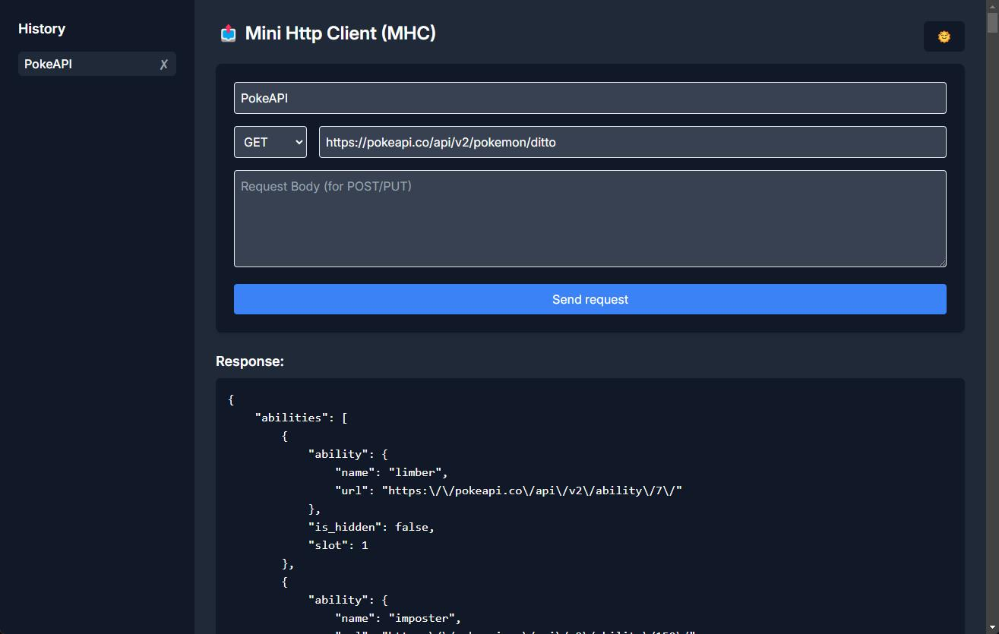

# Mini HTTP Client (MHC)

A minimal HTTP client built with PHP that allows users to send HTTP requests (GET, POST, PUT, DELETE) to a specified URL. This project provides a simple interface for making API requests, formatting responses, and saving past requests for easy reuse.

## Features

- Send HTTP requests (GET, POST, PUT, DELETE)
- Optionally add a request body for POST/PUT methods
- Pretty-print JSON responses
- Dark mode toggle
- Save and reload past requests using local storage

## Technologies

- PHP for backend request handling
- cURL for sending HTTP requests
- TailwindCSS for styling
- JavaScript for local storage management and dark mode toggle

## Dark Mode

You can toggle between dark and light modes using the button in the top-right corner. Your preference is saved in local storage.

## Captures

